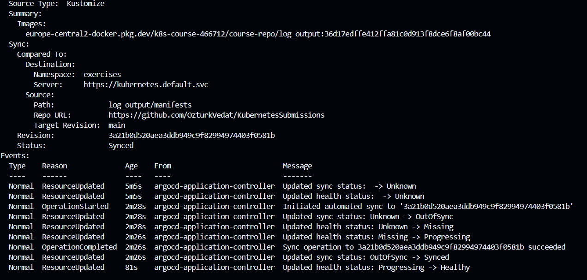

# ArgoCD

We will continue using Github Actions for the CI. But CD to k8s will be done by ArgoCD. Make sure you deployed the cluster and required gateway/lb before deploying ArgoCD.

## Set up

kubectl apply -n argocd -f https://raw.githubusercontent.com/argoproj/argo-cd/stable/manifests/install.yaml

## Deploy

kubectl apply -f app.yaml

## ArgoCD log-output-app logs

