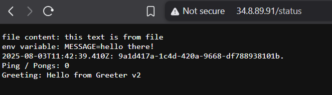

- **Greeter Service**: Responds with a greeting (`v1` and `v2` versions).
- **Log Output App**: Combines data from `ping-pong` and `greeter`, and serves it at `/status`.
- **Gateway and HTTPRoutes**: Use GKE Gateway API to route traffic.

## Greeter in /status

