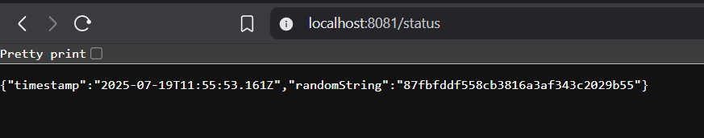

# Log output app

## Build

docker build -t log_output:local .

## Create cluster

k3d cluster create k3s-default --api-port 127.0.0.1:6445 -p "8081:80@loadbalancer"

## Delete cluster

k3d cluster delete k3s-default

## Import to cluster

k3d image import log_output:local -c k3s-default

## Deploy manifests

kubectl apply -f manifests

## Delete deployment

kubectl delete -f manifests/deployment.yaml

## Check pods

kubectl get pods

## Check logs

kubectl logs deployment/log-output

## Request flow

```bash
http://localhost:8081/status

Host machine (browser)
localhost:8081
   ↓
Docker forwards host port 8081 to k3d loadbalancer port 80
   ↓
Ingress controller (Traefik) listens on port 80 inside the cluster
   ↓
Ingress rule matches path /status
   ↓
Ingress forwards to ClusterIP service 'log-output-svc' on port 2345
   ↓
Service forwards request to pod on port 3000
   ↓
Node.js app returns JSON
```

## Browser


