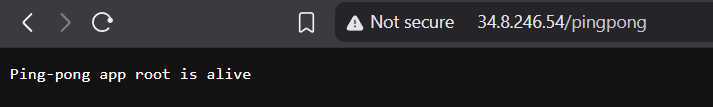
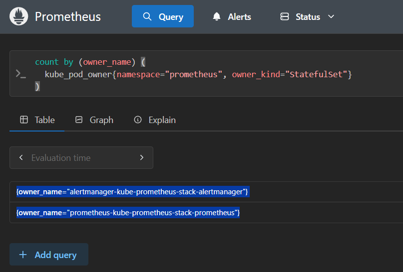
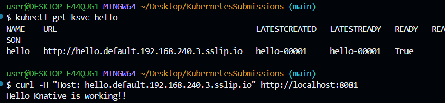

# Ping-pong app

## Build

docker build -t ping_pong:gcr .

## Set the project

gcloud config set project k8s-course-466712

## Tag local image

docker tag ping_pong:gcr gcr.io/k8s-course-466712/ping_pong:gcr

## Push to GCR

docker push gcr.io/k8s-course-466712/ping_pong:gcr

## Apply manifests

kubectl apply -f ping_pong-deployment.yaml

## Browser

## Prometheus UI

## Knative console

