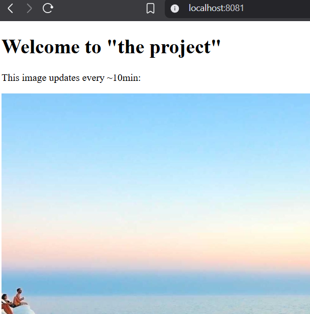

# The Project

## Build

docker build -t the_project:local .

## Create cluster

k3d cluster create k3s-default --api-port 127.0.0.1:6445 -p "8081:80@loadbalancer"

## Delete cluster

k3d cluster delete k3s-default

## Import to cluster

k3d image import the_project:local -c k3s-default

## Deploy the app

kubectl apply -f manifests

## Check pods

kubectl get pods

# Request flow

```bash
Browser http://localhost:8081
   ↓
Host port 8081
   ↓
Mapped to k3d load balancer port 80
   ↓
Ingress Controller (Traefik running inside k3d)
   ↓
Ingress routes request to Service (type: ClusterIP, port 1234)
   ↓
ClusterIP service forwards to Pod port 3000 (targetPort)
   ↓
Node.js app listens on port 3000

```

## Check logs

kubectl logs deployment/the-project

## Browser


