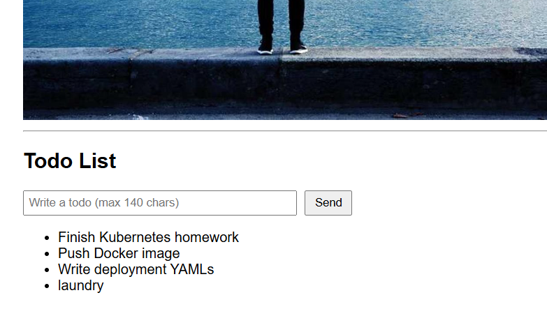

# The Project

## Build

docker build -t todo_backend:local .

## Create cluster

k3d cluster create k3s-default --api-port 127.0.0.1:6445 -p "8081:80@loadbalancer"

## Delete cluster

k3d cluster delete k3s-default

## Import to cluster

k3d image import todo_backend:local -c k3s-default

## Deploy the app

kubectl apply -f manifests

## Check pods

kubectl get pods

## Check logs

kubectl logs deployment/todo-backend

## To-do

