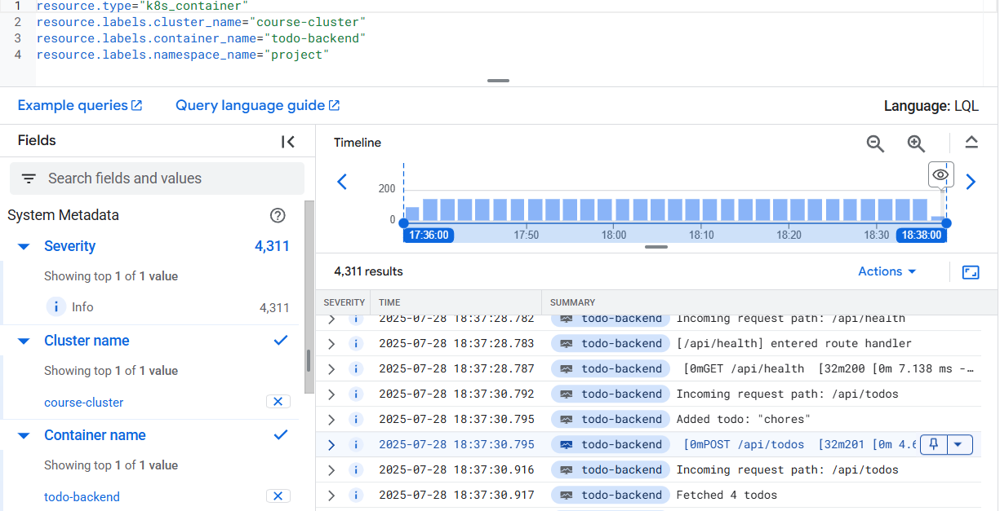

# The Project

## Deploy the app

kubectl apply -f manifests

## Check pods

kubectl get pods

## Check logs

kubectl logs deployment/todo-backend -n project

# Helm

helm repo add grafana https://grafana.github.io/helm-charts
helm repo update

# GCS key for GKE

kubectl create secret generic gcs-key --from-file=key.json=./k8s-course.key.json --namespace=project

## Logs Explorer

